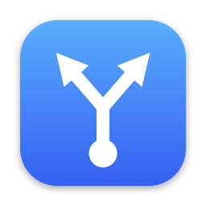

<p align="center">
  
</p>

<h1 align="center">BrowserPicker</h1>

<p align="center">Choose which browser opens each link you click outside a browser.<br>
For macOS and Windows. Small, fast, open source.</p>

<p align="center"><a href="README.ru.md">Русская версия</a></p>

---

Set BrowserPicker as your default browser. When you click a link in Slack, Telegram, Mail,
a terminal, or any other app, a small rounded panel pops up next to the cursor with your
installed browsers. Pick one with the mouse or a key and the link opens there.

## Features

- **Native look.** macOS gets the system popover material (vibrancy) with rounded corners and
  the native pop-in animation. Windows gets a Fluent-style panel with a soft shadow.
- **Smooth.** Spring animations on open, a highlight that slides between browsers,
  staggered content, and a short launch animation. Honors *Reduce motion*.
- **Keyboard-first.** `1`–`9` open a browser at once, arrows or `Tab` + `Enter` select,
  `Esc` dismisses, `⌘C` / `Ctrl+C` copies the link.
- **Stays out of the way.** No Dock or taskbar icon. The tray / menu bar icon is optional.
  Closing the settings window leaves the app running in the background.
- **Launch at login.** Starts quietly without opening any window.
- **Your browsers, your order.** Installed browsers are found automatically. Reorder them
  by dragging, or hide the ones you don't use. With only one browser visible, links open
  straight away with no picker.
- **Lightweight.** Rust + [Tauri 2](https://tauri.app) on the system WebView (WebKit on macOS,
  WebView2 on Windows). No Electron, no bundled Chromium, no JS framework or build step for
  the UI. The installer is a few megabytes. The settings window is destroyed when you close
  it, so only the small, pre-loaded picker stays in memory. That keeps it instant.

## Install

Download the latest `.dmg` (macOS) or `-setup.exe` (Windows) from
[Releases](https://github.com/asmnpl/BrowserPicker/releases).

**macOS 12+.** Drag BrowserPicker to Applications and open it. The builds are not notarized
yet, so the first time, right-click the app and choose **Open**, or run:

```sh
xattr -dr com.apple.quarantine /Applications/BrowserPicker.app
```

**Windows 10/11.** Run the installer. It installs for the current user, so no admin rights
are needed.

Then click **Make Default** in the settings window:

- On **macOS**, the system asks you to confirm the new default browser.
- On **Windows**, the *Default apps* page opens. Choose BrowserPicker for `HTTP` and `HTTPS`,
  or click *Set default*.

## Usage

| Action | How |
| --- | --- |
| Open the link in a browser | Click it, or press `1`–`9` |
| Move the selection | `←` `→` `↑` `↓`, `Tab` / `Shift+Tab`, `Home` / `End` |
| Open the selected browser | `Enter` or `Space` |
| Copy the link | `⌘C` / `Ctrl+C`, or the copy button |
| Dismiss | `Esc`, or click anywhere else |
| Open settings | Tray / menu bar icon, or launch BrowserPicker again |

## Build from source

Prerequisites: [Rust](https://rustup.rs) (stable), [Node.js](https://nodejs.org) 18+ (only for the
Tauri CLI), and the [Tauri prerequisites](https://tauri.app/start/prerequisites/) for your OS
(Xcode Command Line Tools on macOS, WebView2 + MSVC build tools on Windows).

```sh
npm install
npm run dev      # run in development mode
npm run build    # produce the .app/.dmg or the NSIS installer in src-tauri/target/release/bundle
```

To test the picker in dev mode without changing your default browser, pass a URL:

```sh
# Windows: arguments after the second `--` go to the app
npx tauri dev -- -- https://example.com

# macOS: links arrive as Apple Events, which need a real app bundle
npx tauri build --debug --bundles app
open -a src-tauri/target/debug/bundle/macos/BrowserPicker.app https://example.com
```

## How it works

```
ui/                      static HTML/CSS/JS, served by Tauri as is (no bundler)
  picker.*               the popup
  settings.*             the settings window
src-tauri/
  src/lib.rs             app lifecycle, windows, commands for the UI
  src/browsers.rs        browser model, ordering, URL normalization
  src/config.rs          settings stored as JSON in the app config directory
  src/tray.rs            optional tray / menu bar icon
  src/platform/macos.rs  Launch Services discovery, icons, default browser, window tweaks
  src/platform/windows.rs registry discovery, icon extraction, browser registration
  Info.plist             declares http/https/HTML handling; LSUIElement hides the Dock icon
  windows/hooks.nsh      removes the registration on uninstall
```

- **macOS.** `Info.plist` declares the `http`/`https` URL schemes and HTML documents, so the app
  can become the default browser. Links arrive as Apple Events (`RunEvent::Opened`). Browsers
  are found with `NSWorkspace.URLsForApplicationsToOpenURL`. Links open with `open -a`.
- **Windows.** On launch, the app registers itself for the current user under
  `HKCU\Software\Clients\StartMenuInternet` and `RegisteredApplications`, so it appears in
  *Default apps*. Links arrive as a command-line argument, and a single-instance handoff passes
  them to the running process. Browsers and their icons come from the same `StartMenuInternet`
  keys (HKCU and HKLM).
- The picker window is created hidden at startup and reused, so it appears instantly. The web
  UI measures itself, and Rust sizes the window, places it near the cursor on the correct
  monitor, and shows it.

## Roadmap

- Rules: always open certain domains in a given browser
- Browser profiles (Chrome/Edge/Firefox profiles as separate entries)
- Modifier-click to open in a private window
- Signed and notarized builds

Contributions are welcome. Please run `cargo fmt`, `cargo clippy` and `cargo test` in `src-tauri`
before opening a PR.

## License

[MIT](LICENSE)
